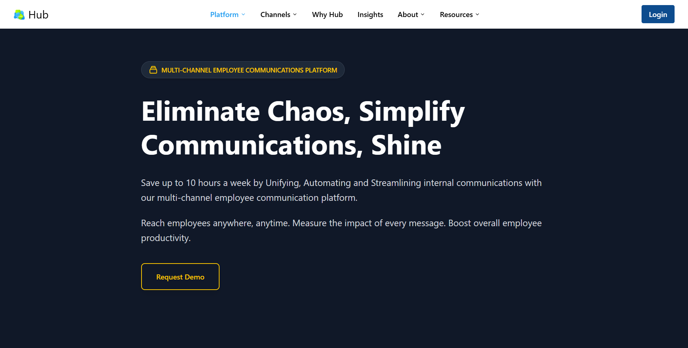
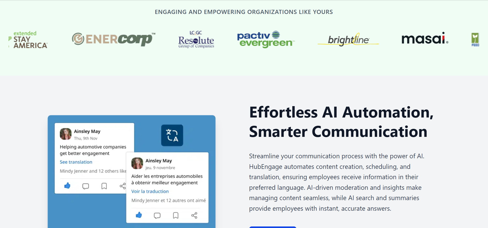
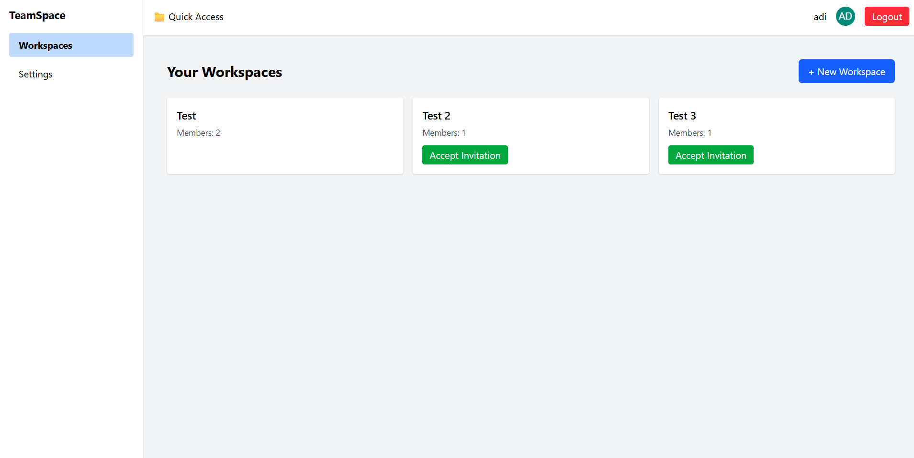
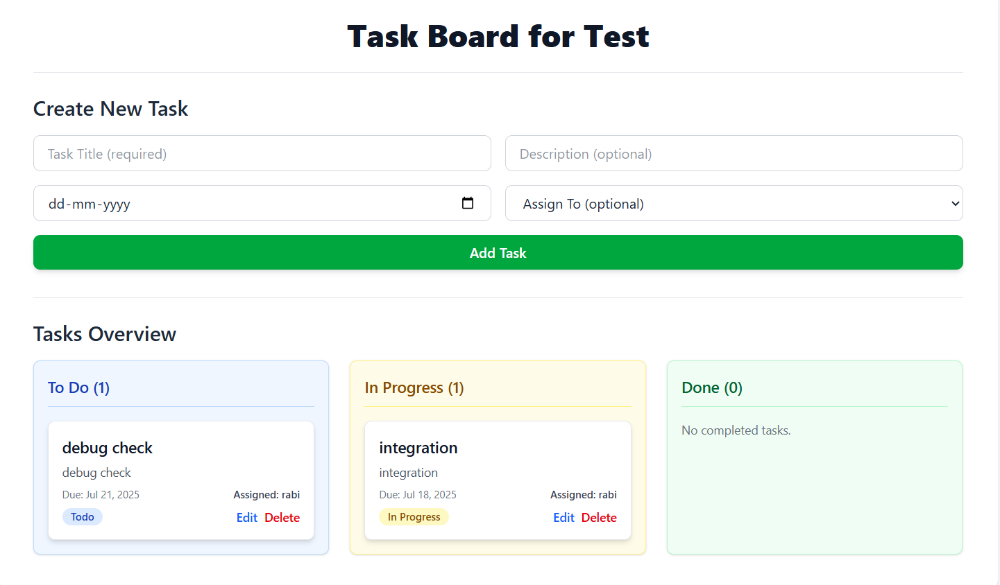
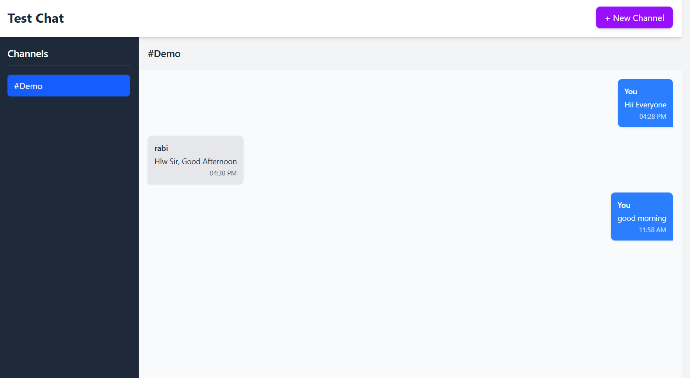
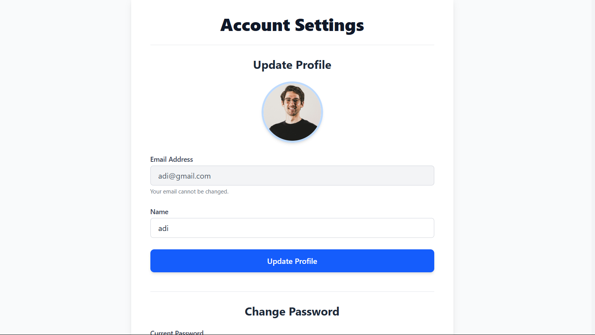

# Collaborative Workspace Frontend

This is the frontend repository for a collaborative workspace application, designed to provide a rich and interactive user interface for team collaboration features like shared documents, task management, and real-time chat.

---

## ✨ Features

### 🔐 User Interface & Authentication

- Intuitive and responsive design built with **React** and **Tailwind CSS**.
- User registration, login, and secure session management.
- Profile management: update name, upload avatar, change password.

---

### 🏢 Workspace Management

- Dashboard to view and manage all accessible workspaces.
- Detailed workspace view:
  - List members with their roles.
  - Admin-only features: manage member roles, remove members, invite new members.
  - Create new documents within the workspace.
  - Navigate to the task board and chat interface.

---

### 📄 Document Management

- Create new documents with a specified title.
- Open and view existing documents within a workspace.
- _(Future: Real-time collaborative editing of documents)_

---

### ✅ Task Management (Kanban Board)

- Dedicated task board for each workspace.
- Create tasks with title, description, due date, and assigned member.
- Kanban columns: **To Do**, **In Progress**, **Done**.
- Edit tasks: title, description, status, due date, assignee.
- Delete tasks with confirmation.
- Display assigned member's name/email on task cards.

---

### 💬 Real-time Chat

- Real-time chat interface for each workspace.
- List available chat channels (public and private).
- Create public/private channels.
- Send and receive messages instantly.
- Displays sender's name/email.
- Auto-scrolls to the latest message.

---

## 🚀 Technologies Used

- **React.js** – JavaScript library for UI.
- **React Router DOM** – Routing.
- **Tailwind CSS** – Utility-first styling.
- **Axios** – HTTP requests.
- **Socket.IO-client** – Real-time communication.
- **React Hot Toast** – Notifications.
- **Vite** – Fast development tooling.

---

## 🏁 Getting Started

### Prerequisites

- [Node.js](https://nodejs.org/) – LTS version recommended.
- Backend Server – Ensure the [Collaborative Workspace Backend](#) is running.

### Installation

```bash
git clone <frontend-repository-url>
cd <frontend-repository-directory>
npm install  # or yarn install
```

## 🌐 Environment Variables

Create a `.env` file in the root of the project:

```env
VITE_BASE_URL=http://localhost:3000
VITE_SOCKET_URL=http://localhost:3000
```

## 🧩 Key Components & Structure

The app follows a **component-based architecture** and uses `react-router-dom` for navigation.

### 🔹 Main Files

- **App.jsx** – Application entry point. Handles layout setup, route definitions, and Toaster integration.
- **ProtectedRoute.jsx** – Guards routes that require user authentication.

---

### 📂 Pages Directory (`pages/`)

- **Home.jsx** – Public landing page.
- **Dashboard.jsx** – Authenticated layout acting as a parent for nested routes.
- **Workspaces.jsx** – Displays user's workspaces and allows new workspace creation.
- **WorkspaceDetail.jsx** – Shows workspace details, member list, and navigation to documents, tasks, and chat.
- **Tasks.jsx** – Kanban-style task board tied to the current workspace.
- **ChatRoom.jsx** – Real-time chat interface for a selected workspace/channel.
- **Document.jsx** – Placeholder for viewing or editing documents.
- **Settings.jsx** – Allows user to update profile and manage password.

---

### 📂 Components Directory (`components/`)

Reusable UI elements used throughout the app:

- **Navbar**
- **Footer**
- **TaskCard**

---

### 📂 Context Directory (`context/`)

React Context API used for global state management:

- **AuthContext.jsx** – Manages authentication state (e.g., token and user data).
- **WorkspaceContext.jsx** – Tracks and provides active workspace data across components.

---

### 📂 Services Directory (`services/`)

Utility functions to interact with backend APIs:

- Authentication
- Workspace management
- Document and task handling
- Real-time operations (e.g., chat)

---

## 🌐 API Integration & Real-time Communication

- **Axios** – Used to perform REST API calls for:

  - Authentication
  - Workspaces
  - Documents
  - Tasks

- **Socket.IO-client** – Handles real-time communication, primarily in `ChatRoom.jsx`, for sending and receiving messages.

---

## 🎨 Styling

- **Tailwind CSS** – Utility-first CSS framework used for rapid and responsive UI development.
- **Responsive Design** – Ensures optimal layout across mobile, tablet, and desktop devices.

---

## 💡 Future Enhancements

- 🔄 **Real-time Document Editing** – Enable collaborative editing via WebSockets.
- 🔔 **Real-time Notifications** – Notify users of new messages, task assignments, etc.
- 📁 **File Sharing** – Allow file attachments in chats and documents.
- 🔍 **Search Functionality** – Global search across documents, tasks, and chat history.
- ⛓️ **Task Dependencies** – Support subtasks, dependencies, and recurring tasks.
- 🟢 **User Status Indicators** – Show online/offline presence in chat.
- 🧪 **Unit & Integration Testing** – Add tests for components and application logic.

## Images

### Home



### Banner



### Dashboard



### Task



### Chat



### Profile


